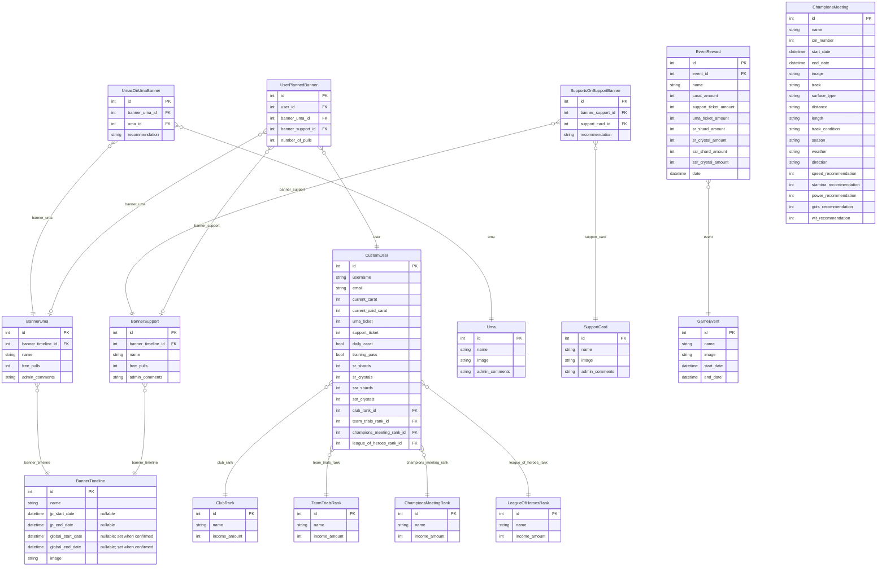

# Data Model

Entity-relationship overview for the `calculatorapi` app. All models live in `calculatorapi/models/`, one file per entity.

---

## ERD

---

## Key Constraints and Design Notes

### `UserPlannedBanner` — exactly-one check constraint

A DB-level `CheckConstraint` named `only_one_support_or_uma` enforces that every row has exactly one of `banner_uma` or `banner_support` set and the other null. The serializer also validates this at the application layer before the row reaches the database.

This is the discriminated union that the frontend mirrors with the `SavedPlannedBanner` / `LocalPlannedBanner` types.

### Rank tables — static reference data

`ClubRank`, `TeamTrialsRank`, `ChampionsMeetingRank`, and `LeagueOfHeroesRank` are static reference tables seeded from fixtures. They are never written to by user-facing endpoints. `CustomUser` holds a nullable FK to the user's current tier in each.

`LeagueOfHeroesRank` data is returned by the API and used by the resource projection — each `LeagueOfHeroes` event whose `end_date` falls within a banner window contributes the user's rank `income_amount` to the carat total.

### Through tables carry recommendation text

`UmasOnUmaBanner` and `SupportsOnSupportBanner` are explicit through models (not Django's auto-generated M2M table) because they carry a `recommendation` field — freeform admin notes about whether a card/uma on a banner is worth pulling. This text is exposed by the `BannerTimelineForViewingSerializer` used in `banner_timeline_data`.

### `EventReward.event` is nullable

The FK from `EventReward` to `GameEvent` allows null, meaning rewards can exist in the database without being attached to a named event. In practice all rewards are attached to an event, but the schema permits orphaned rewards.

### `BannerTimeline` has two serializers

`BannerTimelineSerializer` — the flat version, embedded inside `BannerUma` and `BannerSupport` objects.

`BannerTimelineForViewingSerializer` — the expanded version returned under `banner_timeline_data`, which nests the full `banner_umas` and `banner_supports` lists including the per-card/uma recommendation text from the through tables.

Both serializers share an `EffectiveDateMixin` that emits **resolved** `start_date`/`end_date` (plus an `is_predicted` flag) under the original field names.

### `BannerTimeline` dates are JP-based with predicted global dates

The site targets the **global** server, but global banner dates are only confirmed ~1 month out. The model stores JP dates (`jp_start_date`/`jp_end_date`, always known) and confirmed global dates (`global_start_date`/`global_end_date`, null until confirmed). For unconfirmed banners the global dates are **predicted** from the JP schedule.

Prediction (fixed anchor, in `calculatorapi/predictions.py`):
- **Anchor** = the banner with the greatest `jp_start_date` among those having BOTH a confirmed `global_start_date` and a `jp_start_date`.
- `predicted_global_start = anchor.global_start_date + (target.jp_start_date − anchor.jp_start_date) × 0.7`
- `predicted_global_end = predicted_global_start + (target.jp_end_date − target.jp_start_date)`

The calculator view builds a single effective-date map (keyed by timeline id) once per request and injects it via serializer context, so the resolved dates are consistent across every serialization path. **Prediction requires the anchor to have a `jp_start_date`** — historical rows migrate with JP dates null, so the most-recent confirmed banners must have their JP dates backfilled in the admin for prediction to activate.
